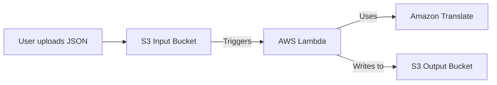

***
 
# 🌐 AWS Translate Automation
 
**A serverless pipeline that automatically translates text from files uploaded to an S3 bucket using AWS Lambda, Amazon Translate, and Terraform.**
 
[](https://www.terraform.io/)

[](https://aws.amazon.com/)

[](https://www.python.org/)
 
## 📁 Project Structure
 
Your repository contains the minimal set of files needed for deployment:
 
```

├── lambda.py          # The Python code for the AWS Lambda function

├── lambda.zip         # The zipped deployment package (created by you)

├── main.tf            # The Terraform configuration to deploy all resources

├── request.json       # A sample input file for testing the service

└── README.md          # This file

```
 
## 🏗️ Architecture
 
The solution implements an event-driven, serverless workflow:
 
1.  **Upload:** A user uploads a JSON file to the S3 Input Bucket.

2.  **Trigger:** The S3 `ObjectCreated` event automatically invokes the Lambda function.

3.  **Process:** The Lambda function reads the file, extracts the text, and sends it to Amazon Translate.

4.  **Translate:** Amazon Translate processes the text into the target language.

5.  **Store:** The Lambda function saves the original and translated text as a new JSON file in the S3 Output Bucket.
 

 
## ⚙️ Prerequisites
 
Before deploying, ensure you have the following:
 
1.  **An AWS account** with appropriate permissions to create resources.

2.  **AWS CLI** installed and configured with your credentials.

    ```bash

    aws configure

    ```

3.  **Terraform** installed on your local machine.

4.  **(Optional) A ZIP utility** if you need to recreate the `lambda.zip` file.
 
## 🚀 Deployment
 
### 1. Package the Lambda Function
 
You've already done this! The command you ran:

```powershell

Compress-Archive -Path .\lambda.py -DestinationPath .\lambda.zip -Force

```

...created the `lambda.zip` file that Terraform will upload to AWS Lambda.
 
*(If you need to do this again after making changes to `lambda.py`, simply re-run the command above.)*
 
### 2. Initialize Terraform
 
This command downloads the required Terraform providers (AWS).
 
```bash

terraform init

```
 
### 3. Review the Execution Plan
 
This command shows you a preview of all the resources that will be created without actually deploying them.
 
```bash

terraform plan

```
 
### 4. Deploy the Infrastructure
 
This command creates the entire AWS infrastructure.
 
```bash

terraform apply

```

Type `yes` when prompted to confirm.
 
## 📤 How to Use the Service
 
### 1. Upload a File for Translation
 
Create a JSON file following this format:
 
**Example `request.json`:**

```json

{

  "text": "Hello World, I'm Selinam. This is a test translation.",

  "source_language": "en",

  "target_language": "de"

}

```
 
-   **`text`**: (Required) The text you want to translate.

-   **`source_language`**: (Optional) The language code of the source text (e.g., `"en"`). Use `"auto"` to let AWS detect it.

-   **`target_language`**: (Required) The language code you want to translate to (e.g., `"es"`, `"fr"`, `"de"`).
 
### 2. Upload to the Input Bucket
 
After running `terraform apply`, you will see the name of your input bucket in the outputs (e.g., `aj-translate-request-bucket`). Use the AWS CLI to upload your file:
 
```bash

aws s3 cp request.json s3://BUCKET_NAME_FROM_TERRAFORM_OUTPUT/

```

*Replace `BUCKET_NAME_FROM_TERRAFORM_OUTPUT` with the actual bucket name.*
 
### 3. Find Your Translated Result
 
After a few seconds, check the output bucket (the name was also in the `terraform apply` output) for a new file. It will be prefixed with `translated_`.
 
```bash

# List files in the output bucket

aws s3 ls s3://BUCKET_NAME_FROM_TERRAFORM_OUTPUT/
 
# Download the translated file to view it

aws s3 cp s3://BUCKET_NAME_FROM_TERRAFORM_OUTPUT/translated_request.json .

```
 
## 🧼 Cleanup (⚠️ Important)
 
To avoid ongoing AWS charges, **always destroy the infrastructure** when you are finished.
 
```bash

terraform destroy

```

Type `yes` when prompted. This will delete the S3 buckets, Lambda function, and all other resources created by Terraform.
 
---
 
## 💡 How It Works (Code Overview)
 
-   **`main.tf`**: This file defines all the AWS resources: S3 buckets, the IAM role for Lambda, and the Lambda function itself, which points to your `lambda.zip` file.

-   **`lambda.py`**: This is the core logic. It is triggered by S3, reads the uploaded file, calls the AWS Translate API with the text, and then saves the result back to S3.

-   **`lambda.zip`**: This is the packaged version of `lambda.py` that AWS Lambda can execute.
 
## 🐛 Troubleshooting
 
-   **Translation not working?** Check the Amazon CloudWatch Logs for your Lambda function. The logs will show any errors that occurred during execution.

-   **`terraform apply` fails?** Ensure your AWS CLI is configured correctly with valid permissions.
 
## 📝 License
 
This project is for educational and demonstration purposes.

 
