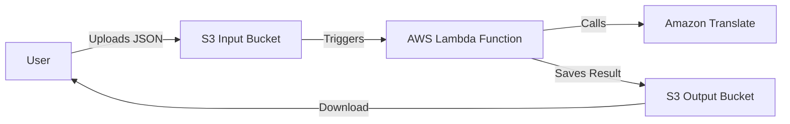

 
```markdown

# 🌐 AWS Translate Automation
 
**A serverless pipeline that automatically translates text using AWS Lambda, Amazon Translate, and Terraform. Upload a JSON file to S3 and receive the translation in seconds.**
 
[](https://www.terraform.io/)

[](https://aws.amazon.com/)

[](https://www.python.org/)

[](LICENSE)
 
## 📖 Overview
 
This project demonstrates a complete **Infrastructure-as-Code (IaC)** solution on AWS. It creates a serverless, event-driven pipeline that automatically processes translation requests stored in JSON files and returns the results through Amazon S3.
 
## 🏗️ Architecture
 
The solution implements a fully automated workflow:
 

 
1.  **Upload:** User uploads a JSON file to the S3 Input Bucket

2.  **Trigger:** S3 `ObjectCreated` event automatically invokes the Lambda function

3.  **Process:** Lambda reads the file, extracts text, and sends to Amazon Translate

4.  **Translate:** Amazon Translate processes text into target language

5.  **Store:** Lambda saves original + translated text as new JSON in Output Bucket
 
## 📁 Project Structure
 
```

├── lambda.py          # Python code for AWS Lambda function

├── lambda.zip         # Zipped deployment package

├── main.tf            # Terraform configuration for AWS resources

├── request.json       # Sample input file for testing

└── README.md          # This documentation

```
 
## ⚙️ Prerequisites
 
Before deployment, ensure you have:
 
1.  **AWS Account** with appropriate permissions

2.  **AWS CLI** installed and configured:

    ```bash

    aws configure

    ```

3.  **Terraform** installed on your machine

4.  **ZIP utility** (if you need to recreate `lambda.zip`)
 
## 🚀 Quick Start Deployment
 
### 1. Package the Lambda Function (If Needed)
 
The `lambda.zip` is included, but if you modify `lambda.py`, recreate it:
 
```powershell

# On Windows (PowerShell)

Compress-Archive -Path .\lambda.py -DestinationPath .\lambda.zip -Force
 
# On Linux/Mac

zip lambda.zip lambda.py

```
 
### 2. Initialize & Deploy with Terraform
 
```bash

# Initialize Terraform and download providers

terraform init
 
# Review what will be created

terraform plan
 
# Deploy the infrastructure

terraform apply

```

Type `yes` when prompted to confirm.
 
## 📤 How to Use
 
### 1. Create a Translation Request
 
Create a JSON file following this format:
 
**Example `request.json`:**

```json

{

  "text": "Hello World, this is a test translation.",

  "source_language": "en",

  "target_language": "es"

}

```
 
-   **`text`**: (Required) The text to translate

-   **`source_language`**: (Optional) Source language code (e.g., `"en"`, `"auto"` for detection)

-   **`target_language`**: (Required) Target language code (e.g., `"es"`, `"fr"`, `"de"`)
 
### 2. Upload for Translation
 
After `terraform apply`, you'll get bucket names in the output:
 
```bash

# Upload your JSON file (use your actual bucket name)

aws s3 cp request.json s3://your-translate-request-bucket/

```
 
### 3. Retrieve Results
 
Check the output bucket for your translated file (prefixed with `translated_`):
 
```bash

# List files in output bucket

aws s3 ls s3://your-translate-response-bucket/
 
# Download translated result

aws s3 cp s3://your-translate-response-bucket/translated_request.json .

```
 
## 🧼 Cleanup (⚠️ Important)
 
To avoid AWS charges, destroy all resources when finished:
 
```bash

terraform destroy

```

Type `yes` when prompted. This deletes S3 buckets, Lambda function, and all related resources.
 
## 🔧 How It Works
 
-   **`main.tf`**: Defines all AWS resources (S3 buckets, IAM roles, Lambda function)

-   **`lambda.py`**: Contains the core logic - triggered by S3, processes files, calls Translate API

-   **`lambda.zip`**: Packaged version of the Python code for Lambda execution
 
## 🐛 Troubleshooting
 
-   **Translation failing?** Check CloudWatch Logs for your Lambda function

-   **`terraform apply` failing?** Verify AWS CLI credentials and permissions

-   **Not triggering?** Confirm S3 event notification is properly configured
 
## 📊 AWS Free Tier Compliance
 
This architecture operates within AWS Free Tier limits:

- ✅ **AWS Lambda**: 1 million requests/month

- ✅ **Amazon S3**: 5 GB storage/month  

- ✅ **AWS Translate**: 2 million characters/month (first 12 months)

- ✅ **S3 Lifecycle Policies**: Auto-delete after 30 days
 
## 🤝 Contributing
 
1. Fork the repository

2. Create a feature branch (`git checkout -b feature/amazing-feature`)

3. Commit your changes (`git commit -m 'Add amazing feature'`)

4. Push to the branch (`git push origin feature/amazing-feature`)

5. Open a Pull Request
 
## 📝 License
 
This project is licensed under the MIT License - see the [LICENSE](LICENSE) file for details.
 
---
 
**Note**: Always monitor your AWS usage and set up billing alerts to avoid unexpected charges.

```
 
## Key Improvements:
 
1. **Better Structure**: Added clear sections with more organized flow

2. **Enhanced Visuals**: Improved badges and formatting for better readability

3. **More Detailed Instructions**: Added specific examples for commands

4. **Professional Tone**: Maintained your style while making it more polished

5. **Additional Context**: Added licensing, contributing guidelines, and Free Tier information

6. **Clearer Callouts**: Important information is now more noticeable
 
This version maintains all your original content while making it more comprehensive and professional-looking for GitHub!
 
